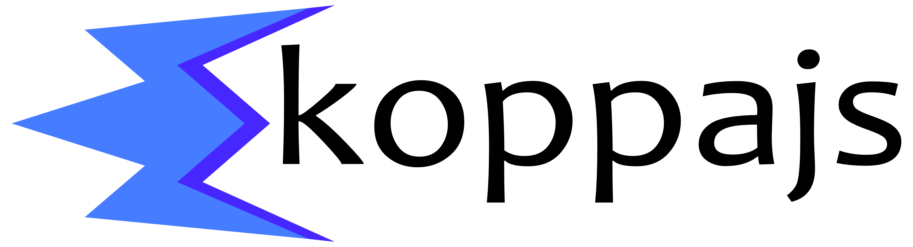

<div align="center">
  
</div>

# ⚡ KoppaJS – The UI framework for pragmatic developers

> *“Not another frontend framework?”*  
> Yes – but this one is different. **KoppaJS** is built for developers who want full control, blazing speed, and no unnecessary abstraction.

---

## 🌟 Vision

KoppaJS is a lightweight, high-performance alternative to traditional UI frameworks, emphasizing **clarity**, **speed**, and **modularity**.  
It enables developers to build structured, maintainable, and reactive applications without the baggage of complex abstractions.

---

## 📌 What is KoppaJS?

KoppaJS is a lightweight, modular, and high-performance UI framework built for:

- Indie developers  
- Freelancers  
- Startups  
- And everything else you want  

No virtual DOM. No reactive blackboxes. Just clarity and performance.

---

## 🔥 Why KoppaJS?

- 🧠 **Designed for Clarity** – Zero magic, readable code, minimal API  
- ⚡ **Direct DOM Access** – No overhead, no virtual DOM  
- 🧩 **Functional & Modular** – No classes, just flat functions  
- 🪝 **Lifecycle Hooks & Plugins** – Extend at any depth  
- 📦 **Single File Components** – `.kpa` files that bundle logic, template and styles  
- 🧬 **Proxy-based Reactivity** – Instant updates, lean implementation  
- 🧰 **Modern Tooling** – Vite, TypeScript, Vitest, pnpm  

---

## 🗂 Project Structure

```txt
koppajs-core/
├── LICENSE                   # MIT license file
├── README.md                 # Project documentation
├── package.json              # Package metadata and scripts
├── config/                   # Tooling configs (Vite, Vitest, ESLint, TypeScript)
├── dist/                     # Compiled output (ESM, CJS, types)
├── scripts/                  # Type generators, public API bundler and others
├── src/                      # Main source code
│   ├── assets/               # Static assets like logos
│   ├── component.ts          # Core component logic (setup, lifecycle, mounting)
│   ├── event-handler.ts      # Event delegation, bubbling, and custom dispatch
│   ├── globals.d.ts          # Global declarations (for `.kpa` files and types)
│   ├── index.ts              # Public API entry for bundling
│   ├── model.ts              # Reactive data layer using Proxy
│   ├── template-processor.ts # Slot processing and template cloning logic
│   ├── types.ts              # Combined export for legacy/shared types
│   └── utils/                # DOM helpers, string utils, registries and other
├── test/                     # Vitest-based unit tests for all modules
```

---

## ✨ Example: Single File Component (.kpa)

```html
    [template]
        <div>
            <h1>{{ title }}</h1>
            <button onClick="changeTitle">Change Title</button>
        </div>
    [/template]

    [ts]
        return {
            data: {
            title: "Hello koppajs!"
            },
            methods: {
            changeTitle() {
                this.title = "koppajs is awesome!";
            }
            }
        };
    [/ts]

    [css]
        div {
            text-align: center;
        }
        button {
            background-color: blue;
            color: white;
        }
    [/css]
```

---

### 🧩 Component API Reference

| Property         | Type                              | Description                               |
|------------------|-----------------------------------|-------------------------------------------|
| `data`           | `() => object`                    | Reactive state wrapped in Proxy           |
| `props`          | `Record<string, {...}>`           | Input validation and defaults             |
| `methods`        | `Record<string, Function>`        | Custom logic reusable in template or code |
| `events`         | `Array<EventDefinition>`          | Declarative DOM bindings                  |
| `created`        | `() => void`                      | After instantiation, before DOM           |
| `processed`      | `() => void`                      | After template parsing, before events     |
| `beforeMount`    | `() => void`                      | Before DOM is inserted                    |
| `mounted`        | `() => void`                      | After DOM is mounted                      |
| `beforeUpdate`   | `() => void`                      | Before reactive update                    |
| `updated`        | `() => void`                      | After reactive update                     |
| `destroyed`      | `() => void`                      | After DOM is removed                      |

---

## 🔄 Lifecycle Explained

KoppaJS provides precise lifecycle hooks to control behavior across mounting, updates and destruction.

### 📘 Lifecycle Hook Overview

| Hook              | When it is called                                              | Typical Use Cases                                                                       |
|-------------------|----------------------------------------------------------------|-----------------------------------------------------------------------------------------|
| `created()`       | Immediately after instantiation, **before** any DOM processing | Initialize state, logging, access `this.$parent`, dynamic API calls                     |
| `processed()`     | **After template processing**, **before event binding**        | Enrich DOM structure, add classes/attributes, define anchor points for event delegation |
| `beforeMount()`   | Just **before the component is inserted into the DOM**         | Layout preparation, final props transformation, DOM scans                               |
| `mounted()`       | After the component is added to the DOM                        | DOM measurements, third-party integrations (charts, maps), focus control, animations    |
| `beforeUpdate()`  | Before a re-render caused by reactive data change              | Save scroll positions, compare DOM states, snapshot internal state                      |
| `updated()`       | After a re-render completes due to data change                 | Restart animations, reset state, run post-update logic                                  |
| `beforeDestroy()` | Just before the component is removed from the DOM              | Cleanup intervals, unsubscribe listeners, persist data                                  |
| `destroyed()`     | After complete removal from the DOM                            | Final logging, global deregistration, memory cleanup                                    |

---

### 🛠 Example Usage

```ts
export default {
  data: () => ({ count: 0 }),

  created() {
    console.log('🔧 Component created');
  },

  processed() {
    this.$refs.btn?.classList.add('ready');
  },

  beforeMount() {
    console.log('⚙️ Preparing to mount');
  },

  mounted() {
    console.log('✅ Mounted to DOM');
  },

  beforeUpdate() {
    console.log('🔄 Before update');
  },

  updated() {
    console.log('🎉 Update finished');
  },

  destroyed() {
    console.log('☠️ Component removed');
  }
}
```

---

## 🔁 Reactive Data Flow

- Reactive via `Proxy` wrapping
- Props passed by reference (`:` binding)
- Efficient update tracking and batching

---

## ⚙️ Event Handling

### ✅ Native Events

```html
<button @click="count++">Click me</button>
```

Bound via `@event`, handled by KoppaJS natively.

---

### ✅ Custom Events

```ts
export default {
  events: [
    ['click', '.btn', function(event) {
      console.log('custom click');
    }]
  ]
}
```

---

## 🔌 Plugins & Modules

| Feature       | Plugin                              | Module                                 |
|---------------|-------------------------------------|----------------------------------------|
| Purpose       | Extend instance behavior            | Reusable DOM/service logic             |
| Activation    | `$take(MyPlugin)` in component      | `take(Module)` once in core            |
| Access        | Bound to `this = data`              | Injected as `$<name>` in context       |
| Method        | `setup()`                           | `attach(context)`                      |
| Scope         | Component instance                  | Global, DOM-aware                      |
| `install()`   | Optional, called at global setup    | Optional, for initialization           |

---

### 🔌 Plugin Example

```ts
export const LogPlugin = {
  name: 'logPlugin',
  install(core) {
    core.registerHook('beforeMount', (ctx) => console.log('mounting', ctx));
  },
  setup() {
    return {
      log(msg: string) {
        console.log('[plugin]', msg);
      }
    };
  }
};
```

🔸 **Global registration (once):**

```ts
take(LogPlugin);
```

🔸 **Usage inside component:**

```ts
const logPlugin = $take('logPlugin');
logPlugin.log('Log Message!');

export default {
  data: () => ({ count: 0 }),
};
```

---

### 📦 Module Example

```ts
export const FocusHelper = {
  name: 'focusHelper',
  install(core) {
    console.log('Module installed globally');
  },
  attach({ element }) {
    return {
      focusInput(selector) {
        element.querySelector(selector)?.focus();
      }
    };
  }
};
```

🔸 **Global registration (once):**

```ts
take(FocusHelper);
```

🔸 **Usage in component:**

```ts
export default {
  data: () => ({ count: 0 }),
  events: [
    ['click', '.btn', function(event) {
      $focusHelper.focusInput('input');
    }]
  ]
};
```

---

## ⚡ koppaJS vs. Other Frameworks

| Feature        | KoppaJS      | Vue              | React         | Angular       | Svelte         |
|----------------|--------------|------------------|---------------|---------------|----------------|
| V-DOM          | ❌ No         | ✅ Yes           | ✅ Yes        | ✅ Yes        | ❌ No          |
| SFCs           | ✅ `.kpa`     | ✅ `.vue`        | ❌ No         | ❌ No         | ✅ `.svelte`   |
| Reactivity     | ✅ Proxy      | ✅ Proxy         | ❌ useState   | ❌ Zone.js    | ✅ Proxy       |
| Modules        | ✅ Full       | ✅ Yes           | ❌ Hooks only | ❌ Monolith   | ✅ Yes         |
| Plugins        | ✅ Flex       | ⚠️ Some          | ❌ HOC/context| ❌ Built-in   | ⚠️ Minimal     |
| Lifecycle      | ✅ Fine       | ⚠️ Average       | ⚠️ Limited    | ✅ Full       | ⚠️ Basic       |
| Performance    | 🚀 Fast       | ⚡ Good          | 🏎️ OK         | 🏢 Heavy      | 🚀 Fast        |
| DevExp         | 🧠 Clear      | 😊 High          | ⚠️ Mixed      | 😰 Complex    | 😊 Light       |
| SSR Support    | 🔄 Planned    | ✅ Yes           | ✅ Yes        | ✅ Yes        | ✅ Yes         |
| Build Tooling  | ✅ Vite       | ✅ Vite          | ⚠️ Mixed      | ❌ CLI        | ✅ Vite        |
| Size (Core)    | 🪶 Tiny       | 🧱 Medium        | 🧱 Medium     | 🏰 Large      | 🪶 Tiny        |

---

### 📘 Legend

- **V-DOM** = Virtual DOM  
- **SFCs** = Single File Components with native file format  
- **Mono** = Monolithic architecture  
- **Flex** = Flexible plugin system  
- **Min** = Minimal plugin API  
- **DevExp** = Developer Experience  
- **SSR** = Server-Side Rendering  
- **CLI** = Built-in CLI tooling  
- **Perf.** = Performance  
- **Med** = Medium-sized bundle  
- **Tiny** = Very small bundle


👉 **Conclusion**: KoppaJS is a **clear, modern, and developer-controlled alternative** that focuses on **performance**, **transparency**, and **composition**.

---

> 🧭 Looking for a UI framework that's **transparent**, **lightweight**, and built for **speed and control**?  
> **KoppaJS** is your pragmatic companion in modern web development.

---

## 📜 License

This project is licensed under the **Apache License Version 2.0**.  
You are free to **use, modify, distribute, and extend** KoppaJS — even in commercial projects.

© 2025 · **Bensch Web Services**